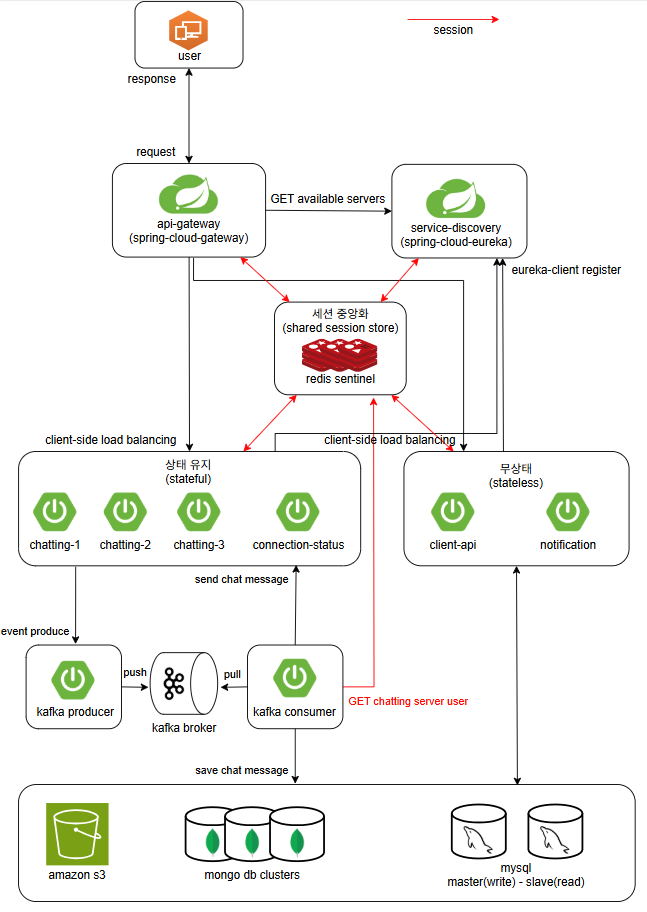
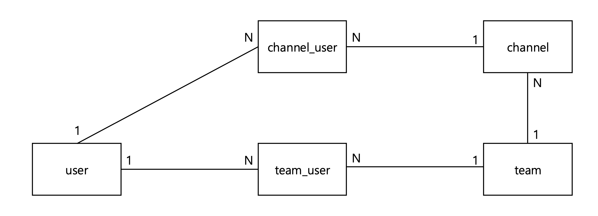
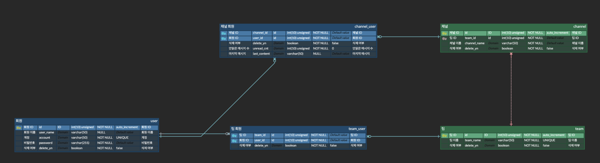
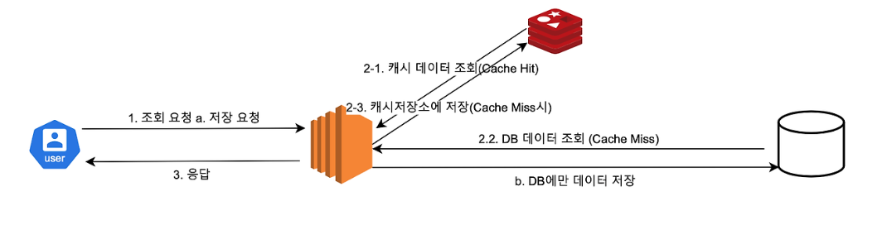

# Distributed Chat System

## 사용법

```markdown
1. docker-compose up --build

2. visit localhost:8080
```

## 모듈 계층

- distributed-chat-system
    - 📂 common
        - 📁 distributed-chat-system-common
    - 📂 infra
        - 📁 distributed-chat-system-api-gateway
        - 📁 distributed-chat-system-mongodb
        - 📁 distributed-chat-system-mysql
        - 📁 distributed-chat-system-redis
        - 📁 distributed-chat-system-service-discovery
    - 📁 distributed-chat-system-chatting
    - 📁 distributed-chat-system-client-api
    - 📁 distributed-chat-system-connection-status
    - 📁 distributed-chat-system-kafka-consumer
    - 📁 distributed-chat-system-kafka-producer
    - 📁 distributed-chat-system-notification

```
distributed-chat-system
  ├── common    # 1 depth - 공통 기능 모듈
  ├── infra     # 2 depth - 인프라 관련 모듈
  └             # 3 depth - 프로젝트 모듈
```

## 아키텍처 설계



# 설계과정

## Think
- 슬랙, 디스코드 같은 대규모 트래픽 서비스를 경험해 보고자 DAU 1,000만 명 규모의 트래픽을 감당할 수 있는 채팅 시스템 아키텍처를 수립하고 데이터 아카이빙 전략을 설계
- 팀 단위 협업 시 개발 생산성을 높이고, 기능 변경과 확장이 용이한 구조를 만들기 위해 서비스별 책임이 명확히 분리된 멀티 모듈 구조를 구축하여 유지보수성과 테스트 효율성을 확보
- RDB로는 기하급수적으로 늘어나는 채팅 데이터의 쓰기/조회 부하를 감당하기 어렵다고 판단하여 샤딩이 가능한 MongoDB 기반으로 채널 단위 메시지 컬렉션을 설계하고, WebSocket 기반 실시간 1:1 및 채널 채팅을 구현
    - 카프카를 Stomp로 사용하는것보단 ‘메시지 전송’ 같은 이벤트를 발행해서 컨슈머에서 관리하는게 맞다고 생각함. 채팅 서버간 의존도 안하게 되어 느슨한 결합도됨.
- 각 채팅 서버 메모리에 독립적으로 존재하는 WebSocketSession간 통신을 위해 유저의 접속 서버 정보를{userId: serverUrl} 형식을 redis로, 서버내 접속한 유저들을 RedisSet으로 저장 https://github.com/rotomoo/distributed-chat-system/blob/723e314b9c29c084696eaedbbb743eed99e30c1f/distributed-chat-system-chatting/src/main/java/com/distributed/chat/system/chatting/base/handler/CustomTextWebSocketHandler.java#L20-L38
- 컨슈머 서버를 통해 채팅 서버 간 직접 연결 없이 메시지 전달 책임을 분리 https://github.com/rotomoo/distributed-chat-system/blob/723e314b9c29c084696eaedbbb743eed99e30c1f/distributed-chat-system-chatting/src/main/java/com/distributed/chat/system/chatting/base/handler/CustomTextWebSocketHandler.java#L40-L52
    - 컨슈머 서버에서 Redis에 저장되어있는 세션 데이터들을 통해 접속한 채팅서버로 메시지를 전달.
    - 이때 컨슈머 서버에서 해당 데이터를 MongoDB에 저장.
    - 실제 전달할 메시지는 채팅서버 메모리를 통해 전송, 이전 메시지는 채팅서버 접속시 MongoDB로 조회.
    어차피 채널 단위로 샤딩이 되어있고 가장 최근 데이터 몇개만 slice로 조회하면 성능도 괜찮을거라 생각됨.
- Spring Cloud를 도입하여 클라이언트 사이드 서비스 디스커버리 패턴 적용.
    - 서버 스케일 아웃, 채팅서버 라우팅 등의 확장에 유리한 아키텍처 적용 https://github.com/rotomoo/distributed-chat-system/blob/723e314b9c29c084696eaedbbb743eed99e30c1f/infra/distributed-chat-system-api-gateway/src/main/resources/application-api-gateway.yml#L12-L24
    - 사용자가 다른 세션으로 재접속하면, 메시지 수신을 위해 각 채팅 서버에 개별 전송 필요하니,
    기존 접속한 서버로 재접속하게 하여 https://github.com/rotomoo/distributed-chat-system/blob/723e314b9c29c084696eaedbbb743eed99e30c1f/infra/distributed-chat-system-api-gateway/src/main/java/com/distributed/chat/system/api/gateway/base/filter/ChattingRoutingFilter.java#L22-L56 Map으로 관리, 새로운 것으로 덮어씌우는 방식으로 설계
    이때 Thread-safe한 ConcurrentHashMap으로 관리하여 동시에 접속하여도 문제없도록 설계 https://github.com/rotomoo/distributed-chat-system/blob/723e314b9c29c084696eaedbbb743eed99e30c1f/distributed-chat-system-chatting/src/main/java/com/distributed/chat/system/chatting/base/handler/CustomTextWebSocketHandler.java#L20-L23
    - Eureka 인스턴스 종료 이벤트 감지 시, 해당 서버에 연결된 사용자의 Redis 세션 정보도 삭제 https://github.com/rotomoo/distributed-chat-system/blob/723e314b9c29c084696eaedbbb743eed99e30c1f/infra/distributed-chat-system-service-discovery/src/main/java/com/distributed/chat/system/service/discovery/base/listener/EurekaInstanceCanceledListener.java#L17-L42
- 서버간 메시지 포맷 불일치를 구글 프로토콜 버퍼(Protobuf)를 도입하여 포맷 일원화를 적용 https://github.com/rotomoo/distributed-chat-system/blob/723e314b9c29c084696eaedbbb743eed99e30c1f/common/distributed-chat-system-common/src/main/proto/eda_chat_message.proto#L1-L9

## 기능 요구사항

- 팀 기능
- 실시간 DM(Direct Message), 채널 채팅 기능
- 실시간 팀 사용자 접속상태 표시 기능
- DAU(Daily Active User) 10,000,000명 지원 시스템
- 멘션 기능
- 채팅 메시지 첨부파일(이미지) 지원 기능
- 채팅 메시지 이모티콘 반응 기능
- 채팅 메시지 댓글 기능
- 채팅 메시지 종단 간 암호화 필요
- 모든 채팅 이력 10년 보관
- 다양한 단말 동시 접속 지원
- 푸시 알림 기능

## 개략적 규모 추정

**데이터 저장 전략**

- Mysql

  회원, 팀, 채널 데이터 저장


- MongoDB

  메시지, 이모티콘 반응, 댓글, 메타데이터 저장  
  <br>
  예시

    ```json
    {
      "messageId": "1353215",
      "channelId": "12345",
      "createUserId": "1142",
      "content": "안녕하세요!",
      "create_dt": "2024-11-18T10:30:00Z",
      "reactions": [
        {
          "emoji": "👍",
          "count": 3
        },
        {
          "emoji": "😂",
          "count": 1
        }
      ],
      "comments": [
        {
          "createUserId": "114346",
          "content": "반가워요!",
          "create_dt": "2024-11-18T10:35:00Z"
        }
      ],
      "attachments": [
        {
          "type": "image",
          "url": "https://s3.amazonaws.com/bucket/file_001.jpg"
        }
      ]
    }
    ```
  <br>
- Redis

  Shared Session Store - Redis 기반 세션 중앙화  <br>
  [Redis Sentinel (Failover : SPOF 방지, 가용성 확보)](https://rotomoo.tistory.com/101)


- S3

  이미지 첨부파일을 저장하고, 파일 URL만 MongoDB에 저장.

<br>

**저장소 요구량**

- DAU (Daily Active Users): 10,000,000명
- 1인당 일일 평균 메시지 전송 수: 20건
- 최대 텍스트 메시지 크기: 200KB (한글, 100,000자 제한)
- 이미지 첨부파일 비율: 20%
- 평균 이미지 크기: 200KB

- 연간 메시지 크기 = 10,000,000 * 20건 X 200KB * 365일 = 14.6PB / year (14,600TB / year)
- 연간 이미지 크기 = 10,000,000 * 20건 * 20% * 200KB * 365일 = 2.92PB / year (2,920TB / year)

- 10년간 MongoDB 저장소 요구량 146 PB
    - 분산(샤딩)

- 10년간 S3 저장소 요구량 = 29 PB
    - S3 분산

<br>

**채팅서버 메모리 요구량**

- 동시 접속자: 1,000,000명
- 접속당 서버 메모리 : 10KB
- 채팅서버 메모리 요구량 : 10GB
    - 트래픽 분산 필요 : 채팅 서버 분산
        - SPOF 방지 : 가용성 확보

<br>

## 기능 목록

**(infra) api-gateway server**

- 가용 서버 라우팅 (spring-cloud-gateway)
    - 기존 접속 채팅 서버 우선 라우팅
    - 채팅 서버
      로드밸런서 [(spring-cloud-loadbalancer, round-robin)](https://docs.spring.io/spring-cloud-commons/reference/spring-cloud-commons/loadbalancer.html)

<br>

**(infra) service-discovery server**

- client-side discovery (spring-cloud-eureka)
    - 가용 서버 정보 동기화

<br>

**chatting server**

- 메시지 전송
- 메시지 수신

<br>

**client-api server**

- 회원가입
- 로그인
- 팀 목록 조회
- 멘션 회원 목록 조회

<br>

**connection-status server**

- 팀 사용자 접속상태 박동(heartbeat) 검사
- 팀 사용자 접속상태 목록 조회

<br>

**kafka-consumer server**

- 채팅 메시지 전송 이벤트 소비

<br>

**kafka-producer server**

- 채팅 메시지 전송 이벤트 발행

<br>

**notification server**

- 미수신 메시지 푸시 (웹 푸시 + 안읽은 메시지 수 cnt)

<br>

## DB 설계

**Mysql**

- 도메인 모델 분석
  
- 테이블 설계
  
- 분산 처리
    - Replication : 주(master) - 쓰기 연산, 부(slave) - 읽기 연산
    - Failover : 가용성 확보

<br>

**MongoDB**

- 컬렉션 설계
- 분산 처리
    - 샤딩 키 : ChannelId

## 채팅 메시지 흐름 (시퀀스 다이어그램 그려봐야됨)

**Client-Server 양방향 통신 [Web Socket 프로토콜](https://rotomoo.tistory.com/100)**

<br>

## 세션 관리 (시퀀스 다이어그램 그려봐야됨)

<br>

## 캐시 계층

**Redis [Look Aside + Write Around 전략](https://rotomoo.tistory.com/99)**

**CDN 적용** (나중에 적용해보기)

## 모니터링

**Grafana** (나중에 적용해보기)
