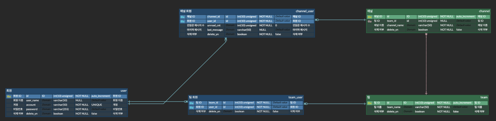

# Distributed Chat System

## 목차

[사용법](#사용법)  
[기능 요구사항](#기능-요구사항)  
[개략적 규모 추정](#개략적-규모-추정)  
[아키텍처 설계](#아키텍처-설계)  
[기능 목록](#기능-목록)  
[DB 설계](#DB-설계)  
[채팅 메시지 흐름](#채팅-메시지-흐름)  
[모듈 계층](#모듈-계층)  
[캐시 계층](#캐시-계층)  
[모니터링](#모니터링)

## 사용법

## 기능 요구사항

- 팀 기능
- 실시간 DM(Direct Message), 채널 채팅 기능
- 실시간 팀 사용자 접속상태 표시 기능
- DAU(Daily Active User) 50,000,000명 지원 시스템
- 멘션 기능
- 채팅 메시지 첨부파일(이미지) 지원 기능
- 채팅 메시지 이모티콘 반응 기능
- 채팅 메시지 댓글 기능
- 채팅 메시지 종단 간 암호화 필요
- 모든 채팅 이력 10년 보관
- 다양한 단말 동시 접속 지원
- 푸시 알림 기능

## 개략적 규모 추정

**데이터 저장 전략**

- Mysql

  유저, 채널, 설정 데이터 저장


- MongoDB

  텍스트 메시지, 메타데이터, 이모티콘 반응, 댓글 저장

  예시

    ```json
    {
      "chatRoomId": "room_12345",
      "participants": ["user_001", "user_002", "user_003"],
      "messages": [
        {
          "messageId": "msg_001",
          "userId": "user_001",
          "content": "안녕하세요!",
          "timestamp": "2024-11-18T10:30:00Z",
          "reactions": {"👍": 10, "❤️": 5},
          "comments": [
            {
              "commentId": "cmt_001",
              "userId": "user_002",
              "content": "반가워요!",
              "timestamp": "2024-11-18T10:35:00Z"
            }
          ],
          "attachments": [
            {
              "type": "image",
              "url": "https://s3.amazonaws.com/bucket/file_001.jpg"
            }
          ]
        }
      ]
    }
    ```


- S3

  이미지 첨부파일을 저장하고, 파일 URL만 MongoDB에 저장.

<br>

**저장소 요구량**

- DAU (Daily Active Users): 50,000,000명
- 1인당 일일 평균 메시지 전송 수: 20건
- 최대 텍스트 메시지 크기: 200KB (한글, 100,000자 제한)
- 이미지 첨부파일 비율: 20%
- 평균 이미지 크기: 200KB

- 연간 메시지 크기 = 50,000,000 * 20건 X 200KB * 365일 = 73PB / year (73,000TB / year)
- 연간 이미지 크기 = 50,000,000 * 20건 * 20% * 200KB * 365일 = 14.6PB / year (14,600TB / year)

- 10년간 MongoDB 저장소 요구량 730 PB
    - 분산(샤딩)

- 10년간 S3 저장소 요구량 = 146 PB
    - S3 분산

<br>

**채팅서버 메모리 요구량**

- 동시 접속자: 1,000,000명
- 접속당 서버 메모리 : 10KB
- 채팅서버 메모리 요구량 : 10GB
    - 트래픽 분산 필요 : 채팅 서버 분산
        - SPOF 방지 : 가용성 확보

<br>

## 아키텍처 설계

## 기능 목록

**client-api 서버**

- 회원가입
- 로그인
- 팀 목록 조회
- 팀 참가
- 팀 알림 음소거
- 멘션 회원 목록 조회

<br>

**connection-status 서버**

- 팀 사용자 접속상태 목록 조회

<br>

**chatting 서버**

- 메시지 전송
- 메시지 수신

<br>

**notification 서버**

- 미수신 메시지 푸시

## DB 설계

**Mysql**

- 도메인 모델 분석
  
- 테이블 설계
  
- 분산 처리
    - Replication : 주(master) - 쓰기 연산, 부(slave) - 읽기 연산
    - 자동 Failover : 가용성 확보

<br>

**MongoDB**

- 컬렉션 설계
- 분산 처리
    - 샤딩 : 샤드 키

## 채팅 메시지 흐름

## 모듈 계층

- **distributed-chat-system**
    - 📂 **module**
        - 📂 **common**
            - 📁 distributed-chat-system-api-base
            - 📁 distributed-chat-system-common
            - 📁 distributed-chat-system-web-socket-base
        - 📂 **database**
            - 📁 distributed-chat-system-mongodb
            - 📁 distributed-chat-system-mysql
        - 📂 **project**
            - 📁 distributed-chat-system-chatting
            - 📁 distributed-chat-system-client-api
            - 📁 distributed-chat-system-connection-status
            - 📁 distributed-chat-system-notification

<br>

~~~
distributed-chat-system
  └── module
      ├── common    # 공통 기능 모듈
      ├── database  # 데이터베이스 관련 모듈
      └── project   # 비즈니스 관련 모듈
~~~

## 캐시 계층

**Redis [Look Aside + Write Around 전략](https://rotomoo.tistory.com/99)**

**CDN 적용**

## 모니터링

**Grafana**